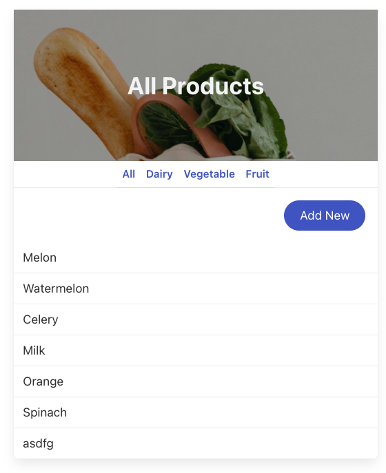

<h1>Shopping List</h1>

A CRUD shopping list App

<h2>Build with</h2>
<h4>Database</h4>
MongoDB
<h4>Backend</h4>
node.js, express
<h4>Frontend</h4>
EJS, Bulma CSS
<h2>Getting started</h2>
To run the project, type from a terminal: 
<code>node index.js</code> 
And open <a href="http://localhost:3000/products">http://localhost:3000/products</a> to view it in the browser.
