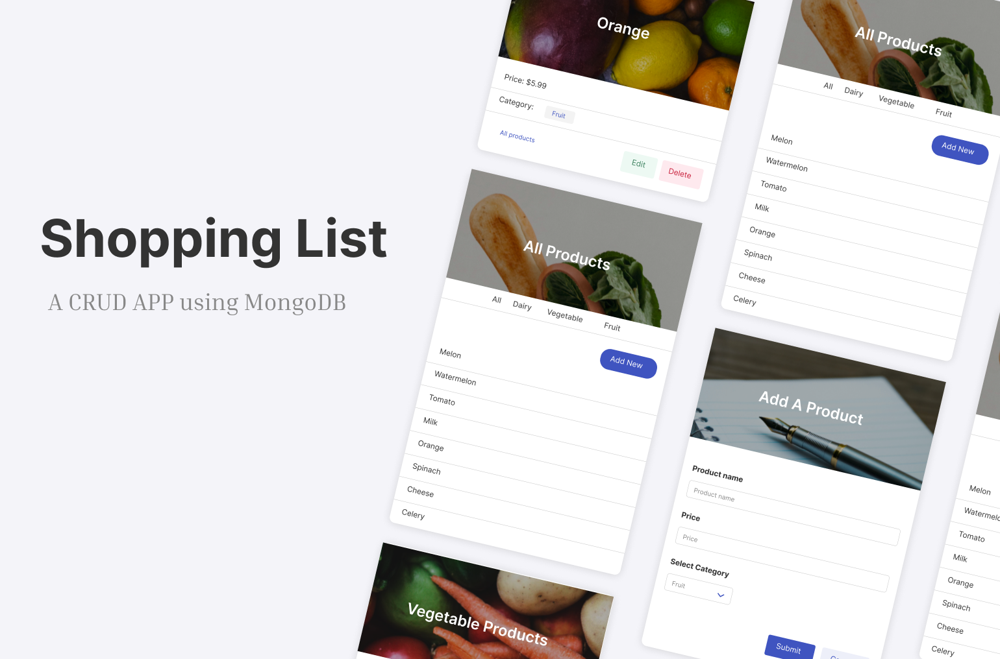

<h1>Shopping List</h1>

This is a CRUD shopping list App using mongoDB

<h2>Build with</h2>
<h3>Database</h3>
MongoDB
<h3>Backend</h3>
node.js, express
<h3>Frontend</h3>
EJS, Bulma CSS
<h2>Getting started</h2>
To run the project, type from a terminal: 
<code>node index.js</code> 
And open <a href="http://localhost:3000/products">http://localhost:3000/products</a> to view it in the browser.
